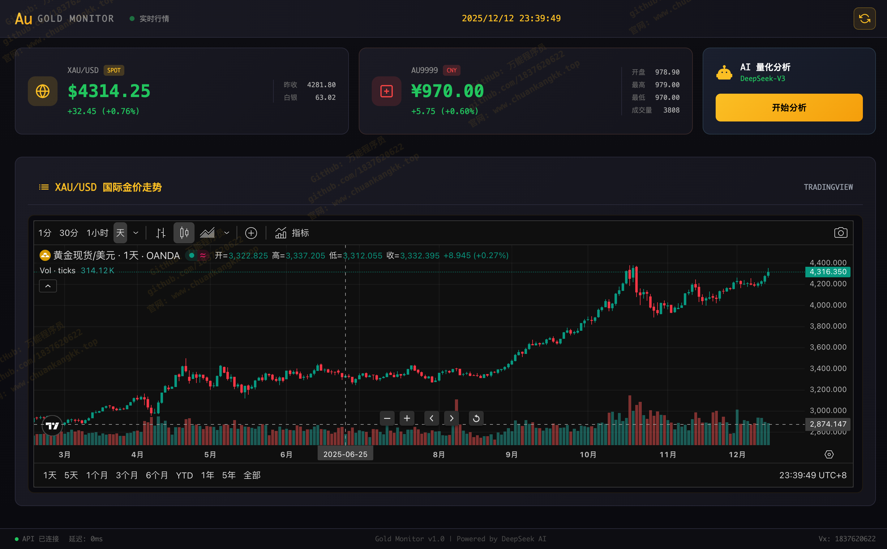
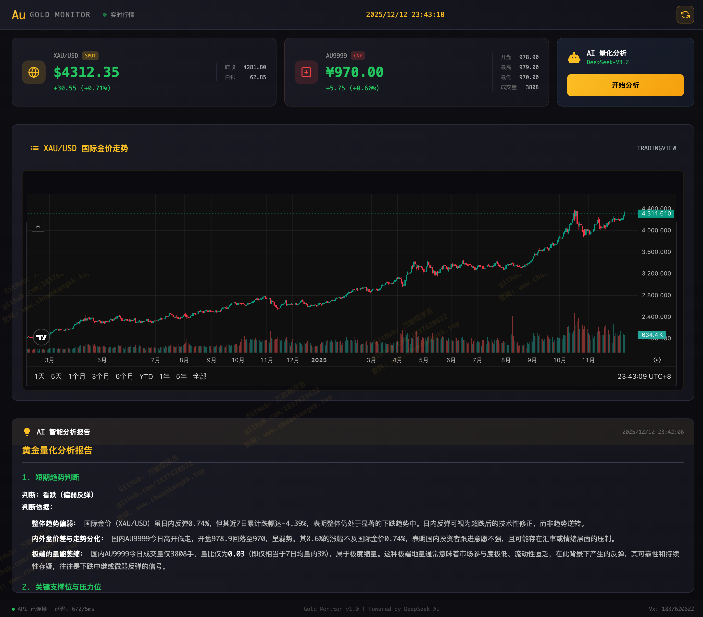

<div align="center">

# 🏆 Gold Monitor - 黄金价格智能监控系统

<p align="center">
  
  
  
  
</p>

<p align="center">
  <a href="https://gold.chuankangkk.top"></a>
  
</p>

<p align="center">
  <strong>🚀 实时金价监控 | 📊 专业K线图表 | 🤖 AI量化分析 | 📲 微信推送</strong>
</p>

<p align="center">
  基于 Vue3 + Hono + DeepSeek AI 构建的专业级黄金价格实时监控与智能量化分析平台
</p>

<p align="center">
  <a href="https://gold.chuankangkk.top">🌐 在线演示</a> |
  <a href="https://github.com/1837620622/Gold-Price-Quantitative-Monitoring-System">📦 GitHub</a> |
  <a href="#-订阅金价推送">📲 订阅推送</a> |
  <a href="#-联系作者">💬 联系作者</a>
</p>

</div>

---

## 📲 订阅金价推送

<div align="center">

<table>
<tr>
<td align="center" width="300">


**扫码订阅金价推送**

</td>
<td>

### 🔔 推送功能

- ⏰ **每30分钟** 自动推送最新金价行情
- 📈 **涨跌预警** 涨跌幅超1%自动推送
- 🤖 **AI分析** 包含DeepSeek智能分析摘要
- 📱 **微信接收** 通过微信公众号接收消息

### 📋 推送内容

- 国内AU9999实时价格
- 国际XAU/USD现货价格
- 涨跌幅与趋势分析
- AI量化投资建议

</td>
</tr>
</table>

</div>

---

## 📸 系统预览

<div align="center">
  
  <p><em>▲ 系统主界面 - 实时价格监控与K线走势</em></p>
</div>

<div align="center">
  
  <p><em>▲ AI智能分析报告 - DeepSeek V3.2 量化分析</em></p>
</div>

---

## ✨ 核心功能

<table>
<tr>
<td width="50%">

### 📈 实时价格监控
- 国际金价 XAU/USD 实时行情
- 国内 AU9999 上海黄金交易所数据
- 白银价格同步显示
- 涨跌幅实时计算

</td>
<td width="50%">

### 📊 专业图表展示
- TradingView 国际金价K线图
- 金投网 AU9999 走势图
- 支持多周期切换
- 专业技术指标

</td>
</tr>
<tr>
<td width="50%">

### 🤖 AI量化分析
- DeepSeek V3.2 最新模型
- 短期趋势判断
- 支撑位/压力位分析
- 操作建议与风险提示

</td>
<td width="50%">

### 🎨 专业UI设计
- 金融终端风格界面
- 深色主题护眼设计
- 响应式布局适配
- Markdown格式报告

</td>
</tr>
<tr>
<td width="50%">

### 📲 微信推送通知（新增）
- PushPlus 群组推送
- 每30分钟定时推送金价
- 涨跌幅1-2%自动预警
- 美观HTML推送模板

</td>
<td width="50%">

### ⏰ 智能监控预警
- Cloudflare Cron 定时任务
- 金价异动实时预警
- AI分析摘要推送
- 开发者水印标识

</td>
</tr>
</table>

---

## 🛠️ 技术架构

```
┌─────────────────────────────────────────────────────────────┐
│                      Gold Monitor                            │
├─────────────────────────────────────────────────────────────┤
│  Frontend (Vue 3 + Vite)                                    │
│  ├── TailwindCSS 样式框架                                    │
│  ├── ECharts 图表库                                          │
│  ├── TradingView 嵌入图表                                    │
│  └── Marked Markdown渲染                                     │
├─────────────────────────────────────────────────────────────┤
│  Backend (Hono + Cloudflare Workers)                        │
│  ├── 实时价格API聚合                                         │
│  ├── DeepSeek V3.2 AI分析                                    │
│  └── CORS跨域处理                                            │
├─────────────────────────────────────────────────────────────┤
│  Data Sources                                                │
│  ├── GoldPrice.org (国际金价)                                │
│  ├── 东方财富 (国内AU9999)                                   │
│  └── 金投网 (走势图表)                                       │
└─────────────────────────────────────────────────────────────┘
```

---

## 🚀 快速开始

### 环境要求

- Node.js 18.0+
- npm 或 pnpm
- Cloudflare 账号（部署用）

### 本地开发

```bash
# 克隆项目
git clone https://github.com/1837620622/Gold-Price-Quantitative-Monitoring-System.git
cd Gold-Price-Quantitative-Monitoring-System

# 启动后端
cd backend
npm install
npm run dev

# 启动前端（新终端）
cd frontend
npm install
npm run dev
```

访问 `http://localhost:3000` 即可查看系统

---

## 📦 部署指南

### Mac / Linux

```bash
# ========== 后端部署 ==========
cd backend

# 安装依赖
npm install

# 配置API密钥
echo "MODELSCOPE_API_KEY=你的密钥" > .dev.vars

# 部署到Cloudflare
npx wrangler login
npx wrangler secret put MODELSCOPE_API_KEY
npm run deploy

# ========== 前端部署 ==========
cd ../frontend

# 安装依赖
npm install

# 修改API地址（src/App.vue中的API_BASE）

# 构建并部署
npm run build
npx wrangler pages deploy dist --project-name=gold-monitor
```

### Windows

```powershell
# ========== 后端部署 ==========
cd backend

# 安装依赖
npm install

# 配置API密钥（编辑.dev.vars文件）

# 部署到Cloudflare
npx wrangler login
npx wrangler secret put MODELSCOPE_API_KEY
npm run deploy

# ========== 前端部署 ==========
cd ..\frontend

# 安装依赖
npm install

# 构建并部署
npm run build
npx wrangler pages deploy dist --project-name=gold-monitor
```

---

## 📡 API 接口

| 接口 | 方法 | 描述 |
|:-----|:----:|:-----|
| `/api/price/all` | GET | 获取所有价格数据 |
| `/api/price/international` | GET | 获取国际金价 |
| `/api/price/domestic` | GET | 获取国内AU9999价格 |
| `/api/kline?days=30` | GET | 获取K线历史数据 |
| `/api/analyze` | POST | DeepSeek AI量化分析 |
| `/api/push/test` | POST | 测试推送功能 |
| `/api/push/scheduled` | POST | 定时推送（每半小时） |
| `/api/push/force` | POST | 强制推送（无视时间限制） |
| `/api/push/status` | GET | 获取推送状态 |
| `/api/monitor` | GET | 价格监控（自动触发推送） |

---

## 📁 项目结构

```
gold-monitor/
├── 📂 backend/                    # 后端服务
│   ├── 📂 src/
│   │   └── 📄 index.js           # API核心逻辑
│   ├── 📄 package.json
│   ├── 📄 wrangler.toml          # Cloudflare配置
│   └── 📄 .dev.vars              # 环境变量
│
├── 📂 frontend/                   # 前端应用
│   ├── 📂 src/
│   │   ├── 📄 App.vue            # 主组件
│   │   ├── 📄 main.js            # 入口文件
│   │   └── 📄 style.css          # 样式文件
│   ├── 📄 index.html
│   ├── 📄 package.json
│   ├── 📄 vite.config.js
│   └── 📄 tailwind.config.js
│
├── 📂 docs/                       # 文档资源
│   ├── 📷 preview-1.png          # 预览图1
│   └── 📷 preview-2.png          # 预览图2
│
└── 📄 README.md
```

---

## ⚙️ 配置说明

### DeepSeek API

本项目使用 ModelScope 的 DeepSeek V3.2 模型：

```javascript
// API配置
{
  endpoint: "https://api-inference.modelscope.cn/v1/chat/completions",
  model: "deepseek-ai/DeepSeek-V3.2",
  apiKey: "ms-xxxxxxxx"  // 在ModelScope获取
}
```

### 数据源配置

| 数据类型 | 来源 | 更新频率 |
|:--------|:-----|:--------|
| 国际金价 | GoldPrice.org | 实时 |
| 国内AU9999 | 东方财富 | 实时 |
| 国际图表 | TradingView | 实时 |
| 国内图表 | 金投网 | 实时 |

### 📲 PushPlus 微信推送配置

本项目使用 [PushPlus](https://www.pushplus.plus/) 实现微信群组推送，让你随时随地掌握金价动态。

#### 配置步骤

1. **注册账号**：访问 [PushPlus官网](https://www.pushplus.plus/) 注册并完成实名认证
2. **获取Token**：在个人中心复制你的用户Token
3. **创建群组**（可选）：在"我创建的群组"中新建群组，获取群组编码（Topic）
4. **配置环境变量**：

```bash
# 进入后端目录
cd backend

# 配置 PushPlus Token（必填）
npx wrangler secret put PUSHPLUS_TOKEN
# 输入你的 Token，例如：7dba765a07dc482487fefdc88cdd7e11

# 配置群组编码（可选，不填则只推送给自己）
npx wrangler secret put PUSHPLUS_TOPIC
# 输入群组编码，例如：CK-GOLD

# 重新部署使配置生效
npx wrangler deploy
```

#### 推送规则详解

| 类型 | 触发条件 | 推送内容 | 防重复机制 |
|:-----|:---------|:---------|:-----------|
| **定时推送** | 每 30 分钟 | 国内外金价 + AI分析 | 距上次推送≥30分钟 |
| **预警推送** | 涨跌幅 1%-2% | 异动提醒 + AI分析 | 价格变化≥0.5% |

#### 推送内容说明

每次推送包含 **两条消息**：

1. **金价快报**（即时推送）
   - 国内 AU9999 实时价格
   - 国际 XAU/USD 现货价格
   - 涨跌幅和趋势指示

2. **AI智能分析**（约1分钟后推送）
   - 短期趋势判断
   - 支撑位/压力位分析
   - 操作建议摘要

#### 配额说明

- **定时推送**：48次/天 × 2条 = 96条
- **预警推送**：约5-10次/天 × 2条 = 10-20条
- **每日总计**：约 106-116 条
- **PushPlus免费额度**：200条/天 ✅ 完全够用

---

## 🤝 联系作者

<div align="center">

| 平台 | 联系方式 |
|:----:|:--------|
| 💬 微信 | `1837620622`（传康kk） |
| 📧 邮箱 | `2040168455@qq.com` |
| 🐟 咸鱼 | 万能程序员 |
| 📺 B站 | 万能程序员 |
| 🌐 官网 | [www.chuankangkk.top](https://www.chuankangkk.top) |
| 💻 GitHub | [github.com/1837620622](https://github.com/1837620622) |

</div>

---

<div align="center">

**⭐ 如果这个项目对你有帮助，请给个 Star 支持一下！**

<p>
  
  
</p>

Made with ❤️ by 万能程序员

</div>
